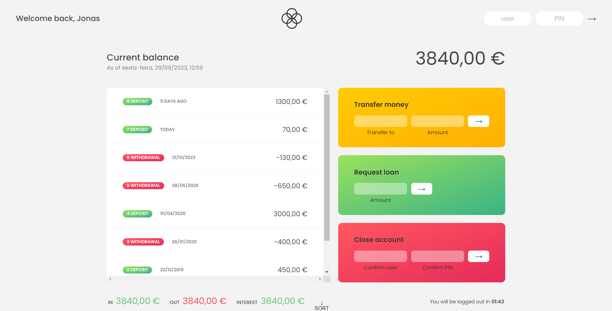

## Bankist-App

This app is basically based on the banking system how transaction is going on betweeen different user in which they send and receive the money to each other , requesting loan and see their transaction summary and balance.
In this project i use different array methods of javascript , about objects in javascript and many more so finally this project gives me more confidence and more things to learn .
And this project is basically from the Jonas Schemedtsman javascript course from udemy.

### Screenshot

You can visit [here](https://siddhantbadoni.github.io/Bankist-App/) for searching the web.